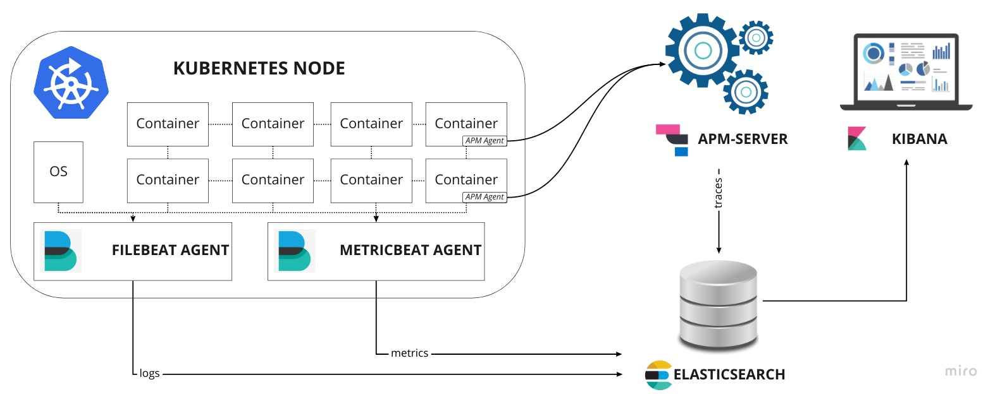
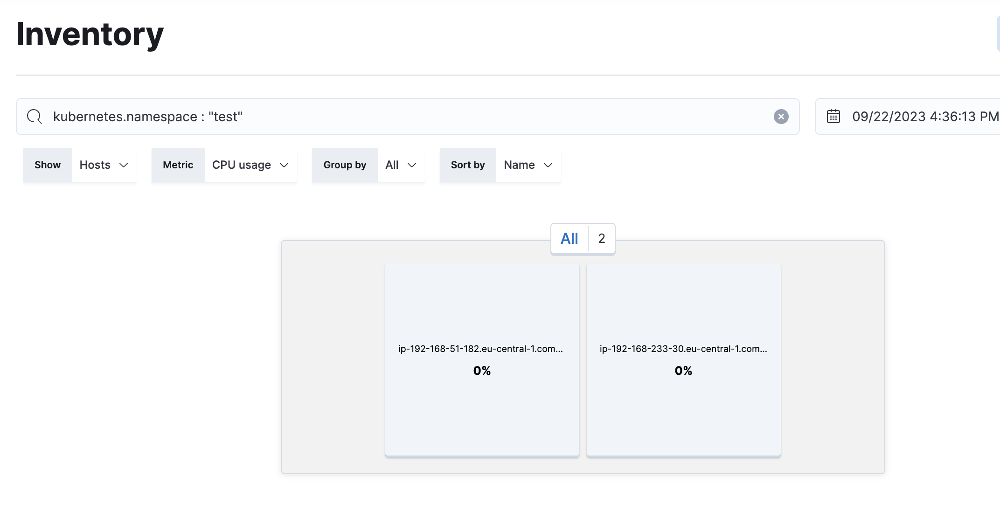

# Installation of Elastic Cloud on Kubernetes (ECK) on a Kubernetes Cluster

## 1. Install ECK on Kubernetes Cluster

```bash
kubectl create -f https://download.elastic.co/downloads/eck/2.9.0/crds.yaml
```
## 2 Apply the ECK Operator

```bash
kubectl apply -f https://download.elastic.co/downloads/eck/2.9.0/operator.yaml
```
## 3 Apply the ElasticSearch Cluster

```bash
kubectl apply -f elastic.yaml -n elastic-system
```
### Get the password for the elastic user

```bash
kubectl get pods -n elastic-system

kubectl get services -n elastic-system

PASSWORD=$(kubectl get secret elasticsearch-es-elastic-user -n elastic-system -o go-template='{{.data.elastic | base64decode}}')

echo $PASSWORD 
```
### Test the ElasticSearch Cluster

```bash
kubectl port-forward service/elasticsearch-es-http 9200 -n elastic-system

curl -u "elastic:$PASSWORD" -k "https://localhost:9200"
```

## 4 Apply the Kibana Cluster

```bash
kubectl apply -f kibana.yaml -n elastic-system
```

### Test the Kibana Cluster

```bash
kubectl get svc -n elastic-system //kibana-kb-http

kubectl port-forward service/kibana-kb-http 5601 -n elastic-system
```

Then open http://localhost:5601 in a browser and log in with elastic user and password

Note: For getting the password for the elastic user, see step 3

## 5 Apply the Filebeat DaemonSet

**Important**: Before applying the filebeat daemonset, change condition.**equals.kubernetes.namespace:** to desired namespace in **filebeat_autodiscover.yml** file

```bash 
kubectl apply -f filebeat_autodiscover.yml -n elastic-system 
```

## 6 Apply the Metricbeat DaemonSet

```bash
kubectl apply -f metricbeat_autodiscover.yml -n elastic-system
```

Filter Metrics/Inventory by namespace in kibana



## 7 Apply the APM Server

```bash
kubectl apply -f apm-server.yaml -n elastic-system
```

## 8 Configure APM Agent

For configuring the APM Agent, add the following annotations to the deployment file

```bash 
    co.elastic.logs/json.overwrite_keys: "true"
    co.elastic.logs/json.add_error_key: "true"
    co.elastic.logs/json.expand_keys: "true"
    co.elastic.logs.json-logging/json.keys_under_root: "true"
    co.elastic.logs.json-logging/json.add_error_key: "true"
    co.elastic.logs.json-logging/json.message_key: "message"
```

These annotations are required for parsing the logs. 

For more information, see the following links:
 - https://www.elastic.co/guide/en/beats/filebeat/current/running-on-kubernetes.html
 - https://www.elastic.co/guide/en/ecs-logging/go-zap/master/setup.html

Add the following environment variables to the deployment file

```bash
    - name: ELASTIC_APM_SERVER_URL
      value: "http://apm-server.apm-system.svc:8200"
    - name: ELASTIC_APM_SECRET_TOKEN
      value: "apm-server-token"
    - name: ELASTIC_APM_VERIFY_SERVER_CERT
      value: "false"
```
